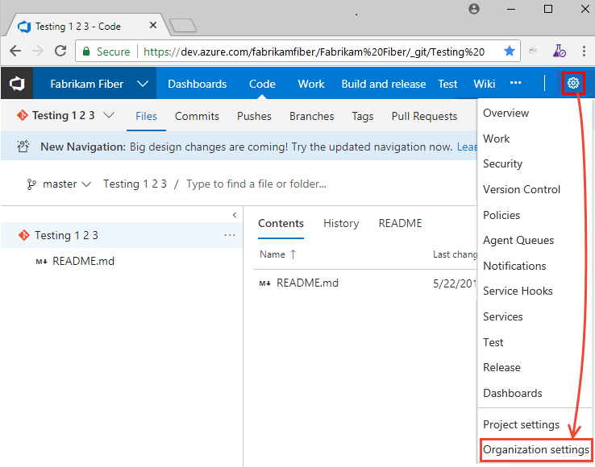
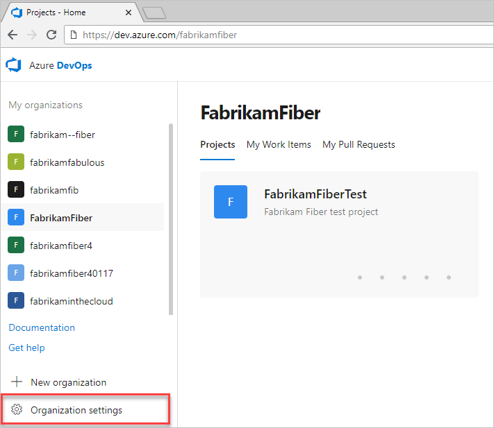
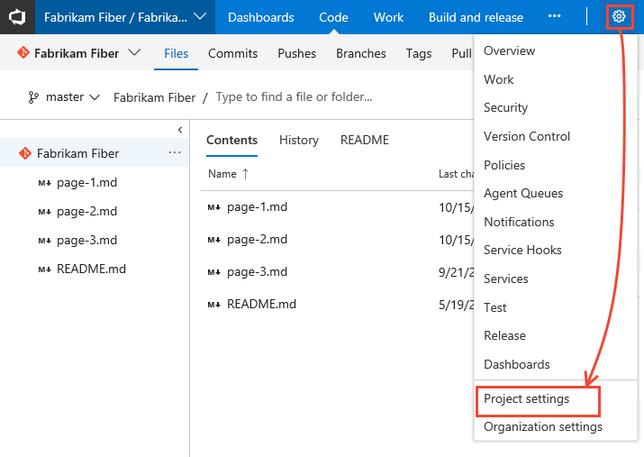
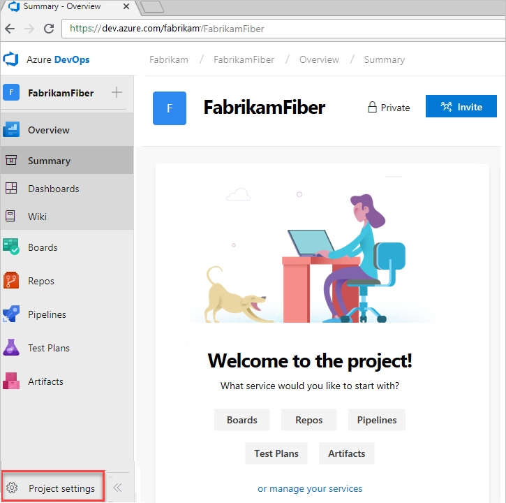

# Azure DevOps navigation guidelines 


With Azure DevOps, users will have a choice of using Horizontal (traditional) navigational model and the New navigation (with a vertical sidebar). To support users in navigating the UI, here are the recommended guidance elements to provide. 

## Provide explicit guidance for Quickstarts and Tutorials

For Quickstarts and Tutorials and other high page view articles, you should provide instructions on how to navigate to the starting page. These procedures should address both the **New Navigation** experience and the previous navigation experience exemplified by the horizontal blue bar. For TFS 2013 through TFS 2018, there is ONLY the horizontal navigation experience. Azure DevOps Server 2019 (previously TFS) and later versions will only support the New Navigation experience.  

Use the Tabbed Conceptual tags to provide content specific to each navigation mode.

```
# [New navigation](#tab/new-nav)


# [Previous navigation](#tab/previous-nav)

---

```


If you include **New navigation** and **Previous navigation** tabs, always place the New navigation content first. New navigation will be the default for Azure DevOps in the future. 

For an example of usage, see the following [Navigation basics](https://docs.microsoft.comazure/devops/project/navigation) ([MD file](https://mseng.visualstudio.com/TechnicalContent/_git/vsts-docs-pr?path=%2Fdocs%2Fproject%2Fnavigation%2Findex.md)).

Also, provide a link to Navigation basics for more information. For example: *To learn more, see [Navigation basics](https://docs.microsoft.comazure/devops/project/navigation/index).*

To learn more about use of tabbed conceptual tags, see [Use of Tabbed Conceptual tags](https://review.docs.microsoft.comnew-hope/resources/tabbed-conceptual?branch=master).

## Provide a link to Navigation basics 

For all topics that aren't Quickstarts or Tutorials, you can provide a link to the Navigation basics in place of explicit instructions. 

## Use INCLUDE files as much as possible 

To cut down on redundancy and increase maintainability, use INCLUDE files as much as possible. In particular, use INCLUDE files when providing introductory content that is the same across several articles. 


## Use _shared image files as much as possible

To reduce content redundancy, it's important to reuse images and content where it makes sense. 

The **/docs/_shared/_img/settings** folder contains a number of common images used to open Organization and Project settings.  


Examples are: 

| Name | Image |
|------|-------|
|open-account-settings-horz-brn.png |  |
|open-admin-settings-vert.png |  |
|open-project-settings-horz.png |  |
|open-project-settings-vert-brn.png |  |


