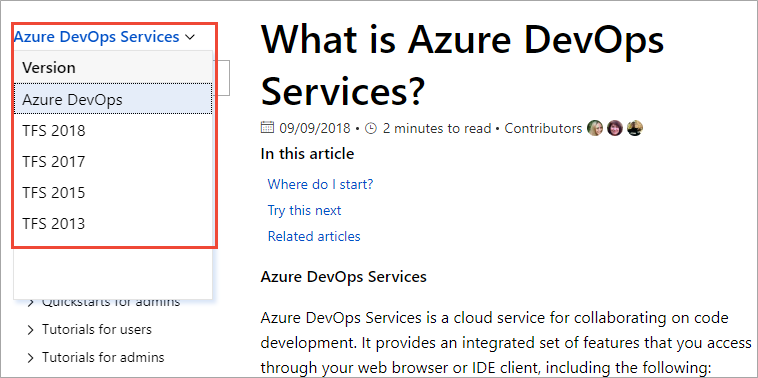

# Azure DevOps versioning guidance and scenarios

Many Azure DevOps articles require the application of moniker tags to support versioning. Users can select between Azure DevOps services and the version of TFS (will become Azure DevOps Server) they are using. The content displayed will only show that content which applies to their selected version, based on the monikers defined within the article. 

Users select the Azure DevOps Services or TFS version from the left-hand TOC to scope the content that is displayed. The **vsts-docs-pr** repository contains content for the cloud product, Azure DevOps Services, and the on-premises product, Team Foundation Server. Versions for TFS 2013 and all later versionsare supported.  



As much as possible, we want to minimize topic versioning. That is, we want each article to address whatever platform/versions that support the task or scenario covered by the content. 

Features and scenarios introduced during an update, such as TFS 2017.2, are handled through notes. These notes are encapsulated within monikers specific to the main version. 
 
As much as possible, we want to maintain the same article (with URL juice) and allow it to cover features introduced first on Team Services and then later into a TFS Update.  
- Articles should be scenario and task-oriented, features are secondary  
- Only when the tasks diverge fully (or lets say 60% or more) between platforms or versions should you consider branching an article to address the differences.  
	
## Azure DevOps monikers 

Azure DevOps services and product versions are associated with monikers. The following table indicates the current monikers that you can use in Azure DevOps articles to control versioning:

| Moniker | Product/Version |
|---|---|
|  **vsts** |Azure DevOps Services | 
|  **tfs-2018** | Team Foundation Server 2018 |
|  **tfs-2017** | Team Foundation Server 2017 |
|  **tfs-2015** | Team Foundation Server 2015 |
|  **tfs-2013** | Team Foundation Server 2013 |

Versioning is implemented at three levels: Zone, Article, and Folder.

Only major level versioning is supported. If new features are added to a version update, for example TFS 2017.2, then you need to make that explicit in the content. 

## Zones within articles

Inside an article, you can version specific **zones** of text. Consider the following taken from the [Add and manage dashboards](https://docs.microsoft.comazure/devops/report/dashboards/dashboards). Zone monikers uses the same moniker range concepts, but they apply to zones inside the article. 


```markdown

::: moniker range="tfs-2015"
> [!NOTE]   
> Multiple team dashboards and the [widget catalog](widget-catalog.md) are available from TFS 2015.1 or later versions. For TFS 2015 and earlier versions, you don't have access to multiple team dashboards. Instead, your home page serves as a [single team dashboard](team-dashboard.md). For information on SharePoint dashboards, see [Project portal dashboards](../sharepoint-dashboards/project-portal-dashboards.md).
::: moniker-end

::: moniker range="tfs-2017"
> [!NOTE]   
> For information on SharePoint dashboards, see [Project portal dashboards](../sharepoint-dashboards/project-portal-dashboards.md).
::: moniker-end


::: moniker range="vsts"
[!INCLUDE [temp](../_shared/dashboard-prerequisites-vsts.md)]  
::: moniker-end

::: moniker range=">= tfs-2017 <= tfs-2018"
[!INCLUDE [temp](../_shared/dashboard-prerequisites-tfs-2017-18.md)] 
::: moniker-end

::: moniker range="tfs-2015"
[!INCLUDE [temp](../_shared/dashboard-prerequisites-tfs-2015.md)] 
::: moniker-end
 
```


## Article level metadata

Article-level versioning is applied when the article applies to select versions. You add a **monikerRanger** metadata value to the article. This overrides the folder-level defaults. Consider the following portion of metadata:

```
ms.topic: quickstart
monikerRange: '>= tfs-2015'
ms.date: 07/21/2018
---
```

In this example, the article applies to all versions of TFS 2015 and greater (`>= tfs-2015`) including Azure DevOps Services

In the following example, the article applies to only versions TFS 2013 and TFS 2015. 

```
monikerRange: '>= tfs-2013 <= tfs-2015'
ms.date: 08/11/2016
---
```

## Folder level defaults

Each folder in the repository has a versioning default assigned in the **vsts-docs-pr/docs/docfx.json** file in the repository. This means that new articles are automatically versioned just by their location.

Folder-level monikers have been applied to the following folders: 

```
    "fileMetadata": {  
      "monikerRange": {  
        "report/admin/**": ">= tfs-2013 <= tfs-2018",  
        "report/analytics/**": "vsts",  
        "report/excel/**": ">= tfs-2013 <= tfs-2018",  
        "report/extend-analytics/**": "vsts",  
        "report/powerbi/**": "vsts",  
        "report/sharepoint-dashboards/**": ">= tfs-2013 <= tfs-2017",  
        "report/sql-reports/**": ">= tfs-2013 <= tfs-2018",  
        "work/tfs-ps-sync/**": ">= tfs-2013 <= tfs-2015"  
```

## Platform version header  

On many articles, you'll see a platform-version header right below the article title. As the version selector is often ignored by our customers, we want to give them another visual cue as to which platforms and versions an article applies to. Add this type of header to your article right below the title. 

*For articles that span all products:*  
**Azure DevOps Services | TFS 2018 | TFS 2017 | TFS 2015 | TFS 2013**  

*For articles that are specific to a product/service, such as Azure Boards:*  
**Azure Boards | TFS 2018 | TFS 2017 | TFS 2015 | TFS 2013**  

*For articles that are specific to select versions of TFS:*  
**TFS 2018 | TFS 2017 | TFS 2015**  

*For articles that apply only to Azure DevOps Services:*  
**Azure DevOps Services**  


## General guidance for applying monikers 

- Do apply article monikers where needed 
- Do apply zone monikers where needed 
- Don't nest monikers 
- Don't apply monikers around conceptual tabs

When a new feature is introduced, it is usually on the cloud version first, so you apply monikers accordingly. 

When a new version of TFS is released, you need to review the moniker applications and update accordingly. 

## Related articles 
- [Conceptual Versioning](https://review.docs.microsoft.com/new-hope/resources/conceptual-versioning?branch=master)
- [SQL versioning guidance and scenarios for writers](sql-docs-pr-repo-ops-conceptual-versioning.md)
